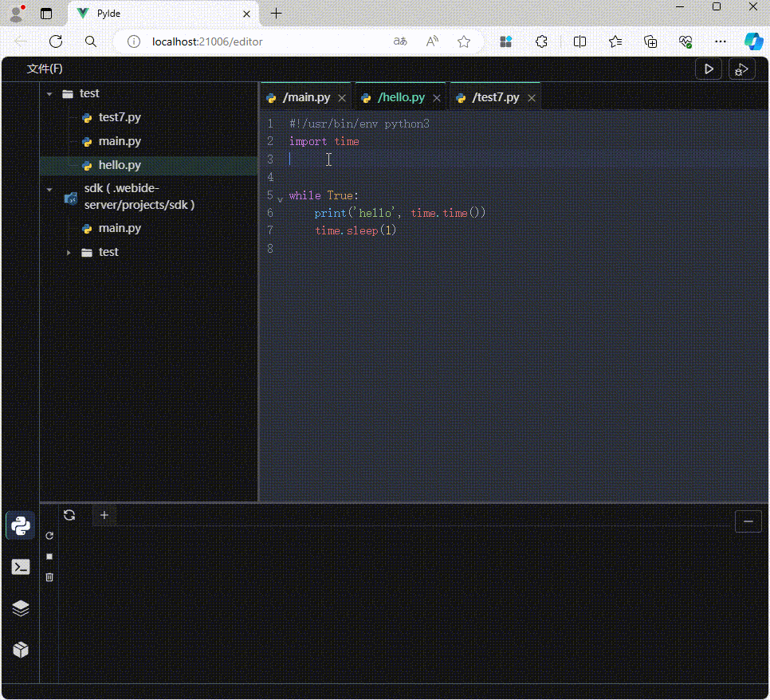
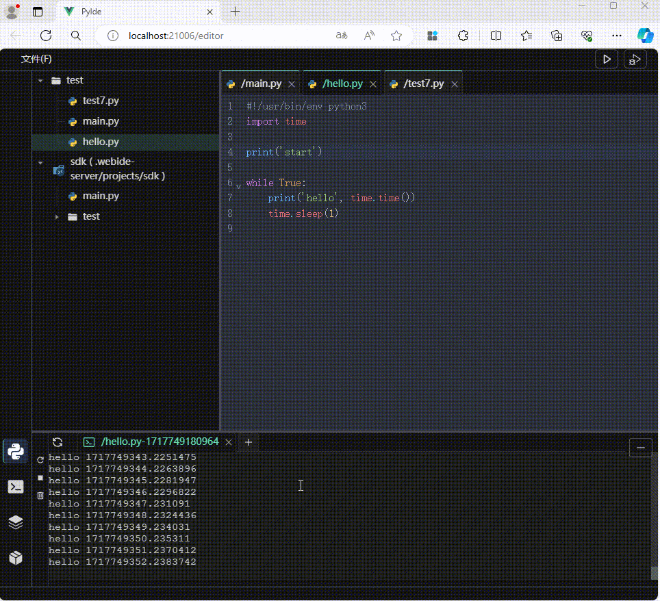
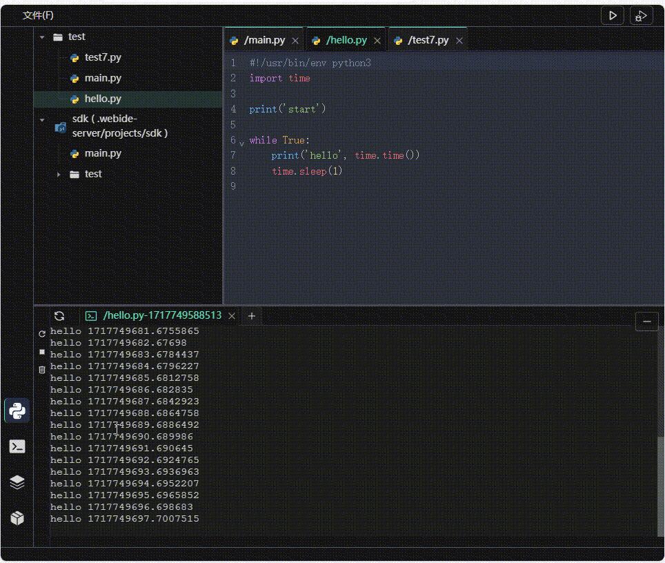
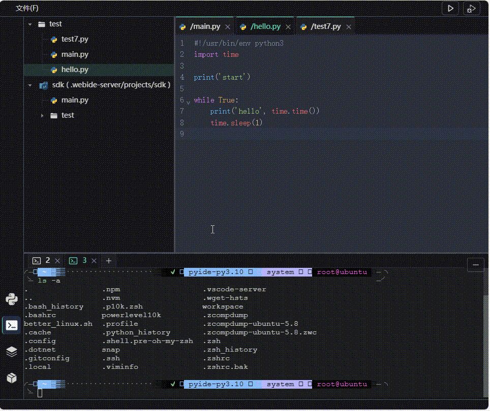
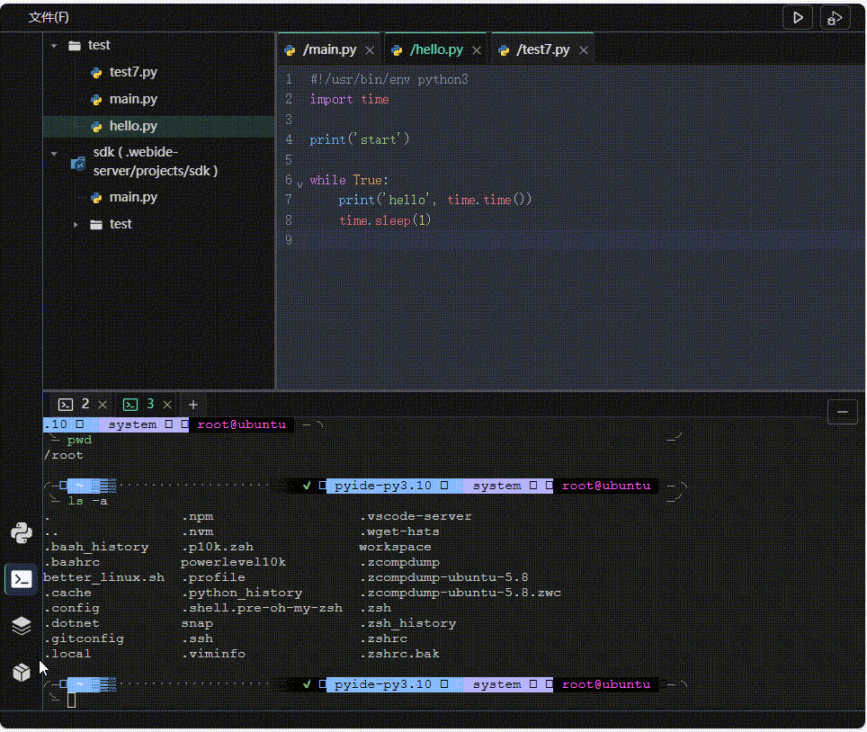
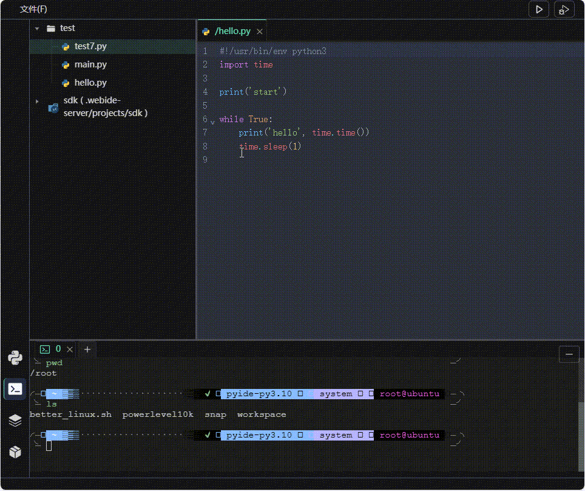

# PyIDE

---

> 一个简易的可运行Python程序的Web IDE  
> 由项目[https://github.com/vimior/PythonWebIDE](https://github.com/vimior/PythonWebIDE)学习而来，Vue3 + Python3.10 + Tornado6.1实现  
> 可前后端分离，重构方向Vite + Vue3 + Python3.10 + FastAPI

## 功能说明

- 支持工程、文件、文件夹的增删查改
- 支持Python代码基本补全
- 支持Python代码运行管理和输出
- 支持Markdown文件的编辑和预览
- 支持终端

## 更新说明

- 基于Vue3+Python3.10的全新实现
- 引入markdown编辑器
- 引入图标vscode-icons
- 更改编辑器主题

## 技术栈

### 前端

- Vue3
- Vite
- Pinia
- TypeScript
- Naive-ui
- shadcn-vue
- axios
- xtermjs
- codemirror

### 后端

- Python3.10
- FastAPI
- uvicorn
- websockets

## 编译和运行

### 开发环境

- Node: 20.12.1
- Yarn: 1.22.22
- Python: 3.10
- FastAPI

```bash
pip install poetry
```

### 安装依赖

```bash
yarn install-all
```

### 运行

> 开发环境

```bash
yarn build

yarn dev-server

yarn dev

# 生产环境预览
yarn build-all
yarn preview-after-build
```

> 生产环境

### 打包

```bash
yarn build-all

# 打成tar包
yarn package-tar
```

命令行运行·，示例：

```bash
./pyide
```

## 演示

### 编辑及运行



### 程序管理（暂停、重启）



### 终端



### 布局调整



### python包管理



### 文件新建、重命名，切换工作区



## 重构进度

### 前端

- [x] 布局，可拖拽调节网格之间比例
- [x] 状态管理从Vuex迁移至Pinia，wsStore，ideStore
- [x] ProjTree绑定文件目录，切换文件
- [x] CodeTabs切换文件
- [x] 代码编辑器读取文件内容
- [x] 代码编辑器写入文件
- [x] 文件树图标、tab栏图标
- [x] 在终端运行代码(命令行式)
- [x] 一键运行
- [x] 多程序运行监控管理
- [x] 文件、文件夹创建删除重命名等操作
- [x] 新建工作区
- [x] 上传文件
- [x] markdown编辑器
- [x] 只读文件提示
- [x] 终端交互，仅支持后端部署在Linux

### 后端

- [x] 构建FastAPI总体框架
- [x] 迁移部分接口
- [x] 重构终端websocket连接
- [x] 任务管理相关api
- [x] 脚本输出捕获
- [x] debug程序接口
- [x] 只读文件获取
- [x] 终端交互，仅支持后端部署在Linux
